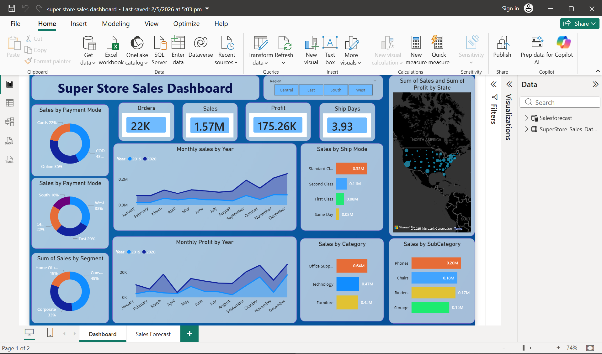
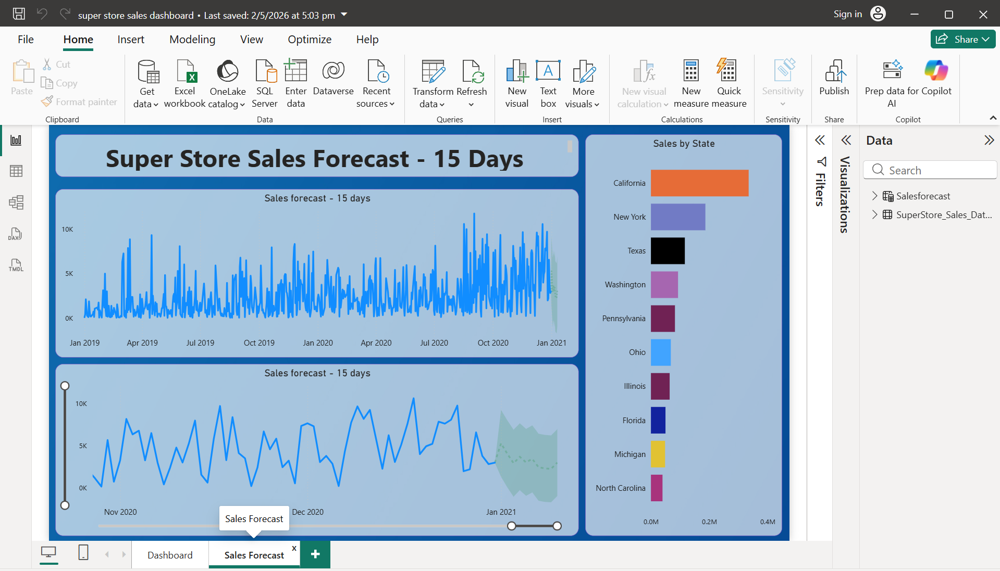

# SuperStore Sales & Profit Analysis

## 📊 Project Overview
This project involves a deep-dive analysis of a "SuperStore" retail dataset to track sales performance, profit margins, and shipping efficiency. Using Power BI, I developed an interactive dashboard that allows stakeholders to explore data by region, product category, and time period to identify growth opportunities.

## 🎯 Business Objectives
* Analyze total sales and profit trends over multiple years (2019-2022).
* Evaluate the performance of different product categories (Furniture, Office Supplies, Technology).
* Identify the most profitable states and regions within the United States.
* Track shipping efficiency by comparing different shipping modes (Standard Class, First Class, etc.).
* Monitor return rates and their impact on overall profitability.

## 🛠️ Tech Stack & Skills
* **Tool:** Power BI Desktop
* **Data Engineering:** Cleaned and transformed raw Excel data using **Power Query**, handling missing values and formatting dates.
* **DAX Measures:** Developed custom measures for **Year-over-Year (YoY) Growth**, **Profit Margin %**, and **Total Returns**.
* **Data Modeling:** Built a relationship model to connect sales data with product and geographical hierarchies.
* **Visualization:** Created a dynamic layout using **Map Visuals**, **Trend Lines**, and **Slicers** for regional and category-based filtering.

## 🖼️ Dashboard Preview

## 📈 Key Insights
* **Top Category:** Technology consistently generates the highest profit margins, despite Furniture often having higher raw sales volume.
* **Regional Performance:** The Western region leads in total sales, while specific states in the Central region show a need for better cost management due to lower margins.
* **Shipping Impact:** "Standard Class" is the most utilized shipping mode, but "First Class" shipments show a higher correlation with customer satisfaction and lower return rates.
* **Seasonality:** Sales peaks are consistently observed in the fourth quarter (October–December), indicating a strong holiday season impact.

## 💡 Final Recommendation
The business should focus on optimizing the supply chain in the Central region to improve the profit-to-sales ratio. Additionally, increasing marketing spend on "Technology" products during the Q3 ramp-up could further capitalize on the high-margin trends observed in the year-end data.
